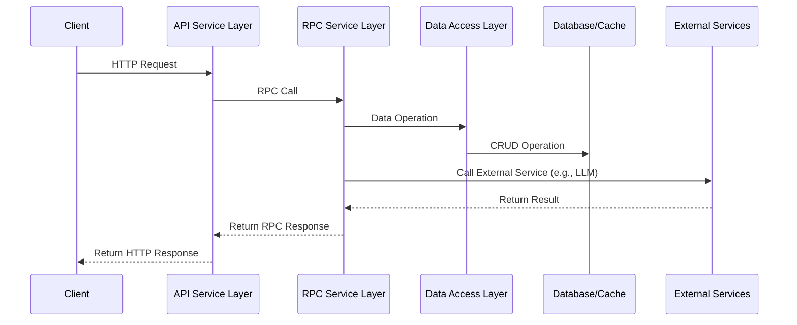

# Overview
English | [中文](README_CN.md)

[Streams to River](https://sstr.trae.com.cn/) is an English learning application. The purpose of this product is to record, extract, and manage English words, sentences, and related contexts encountered in daily life, combined with the [Ebbinghaus Forgetting Curve](https://en.wikipedia.org/wiki/Forgetting_curve) for periodic learning and memorization.

During development, [TRAE](https://www.trae.ai) was extensively used for code development, debugging, annotation, and unit test writing. Through [Coze workflow](https://www.coze.com/), capabilities such as image-to-text, real-time chat, speech recognition, and word highlighting were quickly integrated.

## Project Introduction
### 1.1 Project Introduction and Background

Streams to River V2 is a word learning and language processing microservice system built on the [Hertz](https://github.com/cloudwego/hertz) and [Kitex](https://github.com/cloudwego/kitex) frameworks. 
The system provides a complete solution from API services to RPC implementation, including core functional modules such as user authentication, word management, review progress tracking, real-time chat, speech recognition, and image-to-text conversion, using MySQL and Redis for data storage and cache optimization.

The system is designed to provide users with a comprehensive language learning platform, enhancing learning effectiveness and user experience by combining traditional word learning methods with modern AI technology. 
The system supports features such as word addition, querying, tag management, review progress tracking, and intelligent chat, and integrates multimodal processing capabilities such as speech recognition and image-to-text conversion to provide users with richer and more convenient learning methods.

### 1.2 System Architecture

The system adopts a front-end and back-end separated microservice architecture, mainly divided into the following layers:

1. **API Service Layer**: Based on the Hertz framework, providing HTTP API interfaces to handle requests from the front-end
2. **RPC Service Layer**: Based on the Kitex framework, implementing business logic to handle requests from the API service layer
3. **Data Access Layer**: Including MySQL database and Redis cache, responsible for persistent storage and caching of data
4. **Intelligent Processing Layer**: Integrating large language models (LLM), speech recognition (ASR), and image-to-text functionality

#### System Architecture Diagram


#### Component Interaction Diagram



### 1.3 Technology Stack Overview

| Category                             | Technology/Framework               | Description                                                                         |
|--------------------------------------|------------------------------------|-------------------------------------------------------------------------------------|
| **HTTP Framework**                   | Hertz                              | High-performance Golang HTTP framework for building API services                    |
| **RPC Framework**                    | Kitex                              | High-performance, highly extensible Golang RPC framework for building microservices |
| **Data Storage**                     | MySQL                              | Relational database for persistent storage of user data, word information, etc.     |
| **Cache Service**                    | Redis                              | In-memory database for caching hot data to improve system performance               |
| **Communication Protocol**           | HTTP/RESTful                       | For communication between front-end and API service layer                           |
|                                      | RPC                                | For communication between API service layer and RPC service layer                   |
|                                      | WebSocket                          | For real-time communication, such as speech recognition service                     |
|                                      | Server-Sent Events (SSE)           | For streaming communication, such as real-time chat functionality                   |
| **AI/ML Integration**                | Large Language Model (LLM)         | For intelligent chat, content generation, and word highlighting                     |
|                                      | Speech Recognition (ASR)           | For converting speech to text                                                       |
|                                      | Image Processing                   | For image-to-text functionality                                                     |
| **Monitoring and Observability**     | OpenTelemetry                      | For system monitoring, metrics collection, and performance analysis                 |
| **Security**                         | JWT                                | For user authentication and authorization                                           |
| **Deployment and Service Discovery** | Service Registration and Discovery | For microservice registration and discovery                                         |
|                                      | Dynamic Configuration Management   | For dynamic management of system configuration                                      |

### 1.4 System Functional Modules

#### 1.4.1 User Management

The user management module is responsible for user registration, login, and information management, with the following main functions:

- User registration: Supports registration with username, email, and password
- User login: Supports login with username and password, returns JWT token
- User information retrieval: Retrieves information of the currently logged-in user

#### 1.4.2 Word Learning System

The word learning system is the core functional module of the system, responsible for word management, review, and tag management, with the following main functions:

- Word management: Adding, querying, retrieving details, and listing words
- Tag management: Supporting classification and tagging of words
- Review system: Generating review lists, tracking review progress, and verifying answers
- Word details: Providing word definitions, phonetic symbols, example sentences, and translations

#### 1.4.3 Intelligent Chat

The intelligent chat module is based on large language models (LLM) and provides real-time chat functionality with the following main features:

- Streaming communication: Using Server-Sent Events (SSE) for streaming responses
- Session management: Supporting session ID and context management
- Content highlighting: Supporting highlighting of words in chat content
- Sensitive content review: Filtering chat content for sensitive words

#### 1.4.4 Multimodal Processing

The multimodal processing module integrates speech recognition and image-to-text functionality, providing users with multiple input methods:

- Speech recognition: Converting speech input to text
- Image-to-text: Converting content in images to text descriptions

#### 1.4.5 Documentation Service

The documentation service module provides API documentation and usage guides for the system, with the following main functions:

- API documentation generation: Automatically generating API documentation for the system
- Markdown processing: Supporting processing and conversion of Markdown format documents
- HTML generation: Converting Markdown documents to HTML format

#### 1.4.6 System Monitoring and Management

The system monitoring and management module is responsible for system monitoring, configuration management, and log processing, with the following main functions:

- Performance monitoring: Using OpenTelemetry for performance monitoring and metrics collection
- Configuration management: Supporting dynamic configuration management and environment variable reading
- Log management: Providing unified log recording and management functionality
- Service registration and discovery: Supporting microservice registration and discovery


For more information, please refer to [repome](/apiservice/resource/repome/streams_to_river_repome.md)

## Getting Started

## Configuration
### rpcservice
Update config file: [stream2river](rpcservice/conf/stream2river.yml)
```yaml
LLM:
  ChatModel:
    # You need to go to the Volcano Ark platform https://console.volcengine.com/ark/region:ark+cn-beijing/model/detail?Id=doubao-1-5-pro-32k to apply for the latest Doubao Pro text model and get their latest api_key and model_id
    APIKey: ""
    Model: ""

Coze:
  BaseURL: "https://api.coze.cn"
  # The following fields are configured with reference to rpcservice/biz/chat/coze/README.md
  WorkflowID: ""
  Auth: ""
  Token: ""
  ClientID:
  PublishKey:
  PrivateKey:
```

### apiservice
Update config file: [stream2river](apiservice/conf/stream2river.yml)
```yaml
LLM:
  AsrModel:
    # You can read the "Sentence Recognition" access document in advance: https://www.volcengine.com/docs/6561/80816, and go to the Volcano Ark platform to access the sentence recognition capability https://console.volcengine.com/speech/service/15, and fill in the following AppID / Token / Cluster provided by the platform
    AppID: ""
    Token: ""
    Cluster: ""
  VisionModel:
    # You need to go to the Volcano Ark platform https://console.volcengine.com/ark/region:ark+cn-beijing/model/detail?Id=doubao-1-5-vision-lite to apply for Doubao's latest Vision lite model and get their latest api_key and model_id
    APIKey: ""
    Model: ""

# JWT_SECRET is used to sign and verify JWT tokens. It must be a long, random string.
# Recommended to use at least 32 bytes (256 bits) of random data.
# You can generate a secure random string using the following commands:
#   openssl rand -base64 32
#   or in Python: import secrets; print(secrets.token_urlsafe(32))
JWT_SECRET: your_secret_key
```

###  Run backend services

Before running the backend services, make sure you have installed docker and docker-compose. For more information, see https://docs.docker.com/engine/install/ and https://docs.docker.com/compose/install/ .

After starting the docker service, run `./dockerfile/run.sh` in the project root directory to start the backend services.

### Run frontend services

Refer to the [client/README.md](client/README.md) document.

### LLM Workflow

Refer to the [Coze Config](rpcservice/biz/chat/coze/README.md) document.

## License

Copyright (c) 2025 Bytedance Ltd. and/or its affiliates. All rights reserved.

Licensed under the [MIT](LICENSE) license.