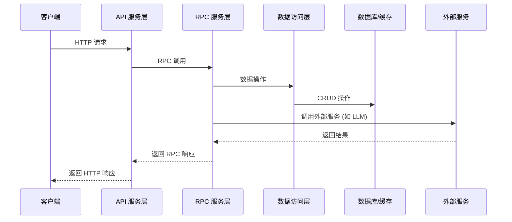

# 概述
[English](README.md) | 中文

[积流成江](https://sstr.trae.com.cn/) （Streams to River）是一款英语学习应用。该产品的初衷是通过将日常所见的英语单词、句子和相关的上下文进行记录、提取和管理,
结合 [艾宾浩斯遗忘曲线](https://zh.wikipedia.org/wiki/%E9%81%97%E5%BF%98%E6%9B%B2%E7%BA%BF)，进行周期性的学习和记忆。

在开发过程中，深度采用了 [TRAE](https://www.trae.cn) 进行代码的开发和调试、注释和单测的编写，通过 [coze workflow](https://www.coze.com/)
快速集成了图像转文字、实时聊天、语音识别、单词划线等大模型能力。

## 项目文档

### 1.1 系统架构

Streams to River 是一个基于 [Hertz](https://github.com/cloudwego/hertz) 和 [Kitex](https://github.com/cloudwego/kitex) 框架构建的单词学习与语言处理微服务系统。该系统提供从 API 服务到 RPC 实现的完整解决方案，
包含用户认证、单词管理、复习进度跟踪、实时聊天、语音识别和图像转文本等核心功能模块。

系统采用前后端分离的微服务架构，主要分为以下几层：

1. **API 服务层**：基于 Hertz 框架，提供 HTTP API 接口，处理来自前端的请求
2. **RPC 服务层**：基于 Kitex 框架，实现业务逻辑，处理来自 API 服务层的请求
3. **数据访问层**：包括 MySQL 数据库和 Redis 缓存，负责数据的持久化存储和缓存
4. **智能处理层**：集成大语言模型 (LLM)、语音识别 (ASR) 和图像转文本等功能

#### 系统架构图


#### 组件调用关系



### 1.2 技术栈概述

| 类别           | 技术/框架                    | 说明                              |
|--------------|--------------------------|---------------------------------|
| **HTTP 框架**  | Hertz                    | 高性能的 Golang HTTP 框架，用于构建 API 服务 |
| **RPC 框架**   | Kitex                    | 高性能、强可扩展的 Golang RPC 框架，用于构建微服务 |
| **数据存储**     | MySQL                    | 关系型数据库，用于持久化存储用户数据、单词信息等        |
| **缓存服务**     | Redis                    | 内存数据库，用于缓存热点数据，提高系统性能           |
| **通信协议**     | HTTP/RESTful             | 用于前端与 API 服务层的通信                |
|              | RPC                      | 用于 API 服务层与 RPC 服务层的通信          |
|              | WebSocket                | 用于实时通信，如语音识别服务                  |
|              | Server-Sent Events (SSE) | 用于流式通信，如实时聊天功能                  |
| **AI/ML 集成** | 大语言模型 (LLM)              | 用于智能聊天、内容生成和单词高亮等功能             |
|              | 语音识别 (ASR)               | 用于将语音转换为文本                      |
|              | 图像处理                     | 用于图像转文本功能                       |
| **监控与可观测性**  | OpenTelemetry            | 用于系统监控、指标收集和性能分析                |
| **安全**       | JWT                      | 用于用户认证和授权                       |
| **部署与服务发现**  | 服务注册与发现                  | 用于微服务的注册和发现                     |
|              | 动态配置管理                   | 用于系统配置的动态管理                     |

### 1.3 系统功能模块说明

#### 1.3.1 用户管理

用户管理模块负责用户的注册、登录和信息管理，主要功能包括：

- 用户注册：支持用户名、邮箱和密码注册
- 用户登录：支持用户名和密码登录，返回 JWT 令牌
- 用户信息获取：获取当前登录用户的信息

#### 1.3.2 单词学习系统

单词学习系统是系统的核心功能模块，负责单词的管理、复习和标签管理，主要功能包括：

- 单词管理：添加、查询、获取详情和列表
- 标签管理：支持对单词进行分类和标记
- 复习系统：生成复习列表、跟踪复习进度和验证答案
- 单词详情：提供单词的定义、音标、例句和翻译等信息

#### 1.3.3 智能聊天

智能聊天模块基于大语言模型 (LLM)，提供实时聊天功能，主要特点包括：

- 流式通信：使用 Server-Sent Events (SSE) 实现流式响应
- 会话管理：支持会话 ID 和上下文管理
- 内容高亮：支持对聊天内容中的单词进行高亮
- 敏感内容审查：对聊天内容进行敏感词过滤

#### 1.3.4 多模态处理

多模态处理模块集成了语音识别和图像转文本功能，为用户提供多种输入方式：

- 语音识别：将语音输入转换为文本
- 图像转文本：将图像中的内容转换为文本描述

#### 1.3.5 文档服务

文档服务模块提供系统的 API 文档和使用指南，主要功能包括：

- API 文档生成：自动生成系统的 API 文档
- Markdown 处理：支持 Markdown 格式的文档处理和转换
- HTML 生成：将 Markdown 文档转换为 HTML 格式

#### 1.3.6 系统监控与管理

系统监控与管理模块负责系统的监控、配置管理和日志处理，主要功能包括：

- 性能监控：使用 OpenTelemetry 进行性能监控和指标收集
- 配置管理：支持动态配置管理和环境变量读取
- 日志管理：提供统一的日志记录和管理功能
- 服务注册与发现：支持微服务的注册和发现

更多参见 [repome](/apiservice/resource/repome/streams_to_river_repome.md)

## 运行方式

## 配置说明
### rpcservice
更新配置文件 [stream2river](rpcservice/conf/stream2river.yml)
```yaml
LLM:
  ChatModel:
    # 你需要到火山方舟平台 https://console.volcengine.com/ark/region:ark+cn-beijing/model/detail?Id=doubao-1-5-pro-32k 申请一个豆包最新的文本Pro模型，获取他们最新的 api_key 和 model_id
    APIKey: ""
    Model: ""

Coze:
  BaseURL: "https://api.coze.cn"
  # 以下字段参考 rpcservice/biz/chat/coze/README.md 配置
  WorkflowID: ""
  Auth: ""
  Token: ""
  ClientID:
  PublishKey:
  PrivateKey:
```

### apiservice
更新配置文件 [stream2river](apiservice/conf/stream2river.yml)
```yaml
LLM:
  AsrModel:
    # 可以先提前阅读"一句话识别"接入文档：https://www.volcengine.com/docs/6561/80816，并且前往火山方舟平台接入一句话识别能力 https://console.volcengine.com/speech/service/15，并填写平台提供的以下AppID / Token / Cluster
    AppID: ""
    Token: ""
    Cluster: ""
  VisionModel:
    # 你需要到火山方舟平台 https://console.volcengine.com/ark/region:ark+cn-beijing/model/detail?Id=doubao-1-5-vision-lite 申请一个豆包最新的Vision lite模型，获取他们最新的 api_key 和 model_id
    APIKey: ""
    Model: ""

# JWT_SECRET 用于签署和验证 JWT 令牌，必须是一个长且随机的字符串
# 建议使用至少32字节(256位)的随机字符串
# 可以使用以下命令生成安全随机字符串:
#   openssl rand -base64 32
#   或者在Python中使用: import secrets; print(secrets.token_urlsafe(32))
JWT_SECRET: your_secret_key
```

### 运行后端服务

提前安装好 docker 和 docker-compose，见 https://docs.docker.com/engine/install/ 和 https://docs.docker.com/compose/install/ 。

启动 docker service后，在项目根目录执行 `./dockerfile/run.sh`，等待服务启动即完成后端服务搭建。

### 运行前端服务

参考 [client/README_CN.md](client/README_CN.md) 文档。

### 大模型工作流

参考 [Coze 配置](rpcservice/biz/chat/coze/README_CN.md) 文档。


## 许可证

版权所有 (c) 2025 Bytedance Ltd. and/or its affiliates。保留所有权利。

根据 [MIT](LICENSE) 许可证授权。