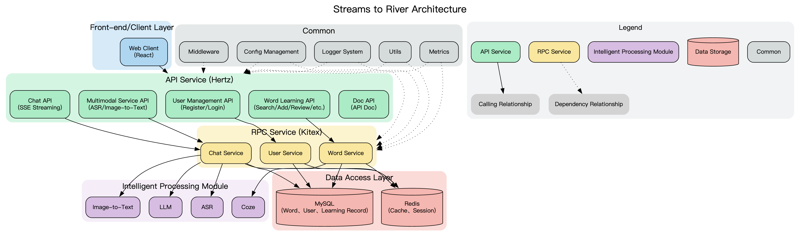

# Streams to River V2 API 文档

## 目录

- [1. 项目概述](#1-项目概述)
  - [1.1 项目简介和背景](#11-项目简介和背景)
  - [1.2 系统架构](#12-系统架构)
  - [1.3 技术栈概述](#13-技术栈概述)
  - [1.4 系统功能模块说明](#14-系统功能模块说明)
- [2. HTTP API 接口详细说明](#2-http-api-接口详细说明)
- [3. RPC 服务接口详细说明](#3-rpc-服务接口详细说明)
- [4. 数据模型](#4-数据模型)
- [5. 使用示例](#5-使用示例)
- [6. 最佳实践](#6-最佳实践)

---

## 1. 项目概述

### 1.1 项目简介和背景

Streams to River V2 是一个基于 Hertz 和 Kitex 框架构建的单词学习与语言处理微服务系统。该系统提供从 API 服务到 RPC 实现的完整解决方案，包含用户认证、单词管理、复习进度跟踪、实时聊天、语音识别和图像转文本等核心功能模块，采用 MySQL 和 Redis 进行数据存储与缓存优化。

系统设计目标是为用户提供一个全面的语言学习平台，通过结合传统的单词学习方法与现代 AI 技术，提升学习效果和用户体验。系统支持单词添加、查询、标签管理、复习进度跟踪和智能聊天等功能，并集成了语音识别和图像转文本等多模态处理能力，为用户提供更加丰富和便捷的学习方式。

### 1.2 系统架构

系统采用前后端分离的微服务架构，主要分为以下几层：

1. **API 服务层**：基于 Hertz 框架，提供 HTTP API 接口，处理来自前端的请求
2. **RPC 服务层**：基于 Kitex 框架，实现业务逻辑，处理来自 API 服务层的请求
3. **数据访问层**：包括 MySQL 数据库和 Redis 缓存，负责数据的持久化存储和缓存
4. **智能处理层**：集成大语言模型 (LLM)、语音识别 (ASR) 和图像转文本等功能

#### 系统架构图



#### 组件调用关系


### 1.3 技术栈概述

| 类别               | 技术/框架                | 说明                                               |
| ------------------ | ------------------------ | -------------------------------------------------- |
| **HTTP 框架**      | Hertz                    | 高性能的 Golang HTTP 框架，用于构建 API 服务       |
| **RPC 框架**       | Kitex                    | 高性能、强可扩展的 Golang RPC 框架，用于构建微服务 |
| **数据存储**       | MySQL                    | 关系型数据库，用于持久化存储用户数据、单词信息等   |
| **缓存服务**       | Redis                    | 内存数据库，用于缓存热点数据，提高系统性能         |
| **通信协议**       | HTTP/RESTful             | 用于前端与 API 服务层的通信                        |
|                    | RPC                      | 用于 API 服务层与 RPC 服务层的通信                 |
|                    | WebSocket                | 用于实时通信，如语音识别服务                       |
|                    | Server-Sent Events (SSE) | 用于流式通信，如实时聊天功能                       |
| **AI/ML 集成**     | 大语言模型 (LLM)         | 用于智能聊天、内容生成和单词高亮等功能             |
|                    | 语音识别 (ASR)           | 用于将语音转换为文本                               |
|                    | 图像处理                 | 用于图像转文本功能                                 |
| **监控与可观测性** | OpenTelemetry            | 用于系统监控、指标收集和性能分析                   |
| **安全**           | JWT                      | 用于用户认证和授权                                 |
| **部署与服务发现** | 服务注册与发现           | 用于微服务的注册和发现                             |
|                    | 动态配置管理             | 用于系统配置的动态管理                             |

### 1.4 系统功能模块说明

#### 1.4.1 用户管理

用户管理模块负责用户的注册、登录和信息管理，主要功能包括：

- 用户注册：支持用户名、邮箱和密码注册
- 用户登录：支持用户名和密码登录，返回 JWT 令牌
- 用户信息获取：获取当前登录用户的信息

#### 1.4.2 单词学习系统

单词学习系统是系统的核心功能模块，负责单词的管理、复习和标签管理，主要功能包括：

- 单词管理：添加、查询、获取详情和列表
- 标签管理：支持对单词进行分类和标记
- 复习系统：生成复习列表、跟踪复习进度和验证答案
- 单词详情：提供单词的定义、音标、例句和翻译等信息

#### 1.4.3 智能聊天

智能聊天模块基于大语言模型 (LLM)，提供实时聊天功能，主要特点包括：

- 流式通信：使用 Server-Sent Events (SSE) 实现流式响应
- 会话管理：支持会话 ID 和上下文管理
- 内容高亮：支持对聊天内容中的单词进行高亮
- 敏感内容审查：对聊天内容进行敏感词过滤

#### 1.4.4 多模态处理

多模态处理模块集成了语音识别和图像转文本功能，为用户提供多种输入方式：

- 语音识别：将语音输入转换为文本
- 图像转文本：将图像中的内容转换为文本描述

#### 1.4.5 文档服务

文档服务模块提供系统的 API 文档和使用指南，主要功能包括：

- API 文档生成：自动生成系统的 API 文档
- Markdown 处理：支持 Markdown 格式的文档处理和转换
- HTML 生成：将 Markdown 文档转换为 HTML 格式

#### 1.4.6 系统监控与管理

系统监控与管理模块负责系统的监控、配置管理和日志处理，主要功能包括：

- 性能监控：使用 OpenTelemetry 进行性能监控和指标收集
- 配置管理：支持动态配置管理和环境变量读取
- 日志管理：提供统一的日志记录和管理功能
- 服务注册与发现：支持微服务的注册和发现

---

## 2. HTTP API 接口详细说明

### 2.1 接口分组和概述

系统的 HTTP API 接口按功能模块分为以下几类：

1. **用户管理相关接口**：负责用户的注册、登录和信息获取
2. **聊天相关接口**：负责实时聊天功能
3. **单词学习相关接口**：负责单词的管理、复习和标签管理
4. **多模态相关接口**：负责语音识别和图像转文本功能
5. **文档相关接口**：负责 API 文档服务

### 2.2 用户管理相关接口

| 路径            | HTTP 方法 | 处理器函数             | 功能描述     |
| --------------- | --------- | ---------------------- | ------------ |
| `/api/register` | POST      | `user.RegisterHandler` | 用户注册     |
| `/api/login`    | POST      | `user.LoginHandler`    | 用户登录     |
| `/api/user`     | GET       | `user.GetUserHandler`  | 获取用户信息 |

#### 2.2.1 用户注册 `/api/register` (POST)

**请求参数**：
- `Username`：用户名
- `Email`：邮箱
- `Password`：密码

**请求示例**：
```json
{
  "Username": "example",
  "Email": "example@example.com",
  "Password": "password123"
}
```

**返回值**：
- 成功：HTTP 200 OK
  ```json
  {
    "user": {
      "ID": 1,
      "Username": "example",
      "Email": "example@example.com"
    },
    "token": "jwt_token"
  }
  ```
- 失败：
  - HTTP 400 Bad Request：请求参数无效
  - HTTP 409 Conflict：用户名已存在
  - HTTP 500 Internal Server Error：密码加密失败或令牌生成失败

**错误响应示例**：
```json
{
  "error": "用户名已存在"
}
```

**权限要求**：
- 无需认证

#### 2.2.2 用户登录 `/api/login` (POST)

**请求参数**：
- `Username`：用户名
- `Password`：密码

**请求示例**：
```json
{
  "Username": "example",
  "Password": "password123"
}
```

**返回值**：
- 成功：HTTP 200 OK
  ```json
  {
    "user": {
      "ID": 1,
      "Username": "example",
      "Email": "example@example.com"
    },
    "token": "jwt_token"
  }
  ```
- 失败：
  - HTTP 401 Unauthorized：用户名或密码错误
  - HTTP 400 Bad Request：请求参数无效

**错误响应示例**：
```json
{
  "error": "用户名或密码错误"
}
```

**权限要求**：
- 无需认证

#### 2.2.3 获取用户信息 `/api/user` (GET)

**请求参数**：
- 无（需要在请求头中包含 JWT 令牌）

**请求头**：
```
Authorization: Bearer jwt_token
```

**返回值**：
- 成功：HTTP 200 OK
  ```json
  {
    "ID": 1,
    "Username": "example",
    "Email": "example@example.com"
  }
  ```
- 失败：
  - HTTP 401 Unauthorized：未授权或令牌无效

**错误响应示例**：
```json
{
  "error": "未授权或令牌无效"
}
```

**权限要求**：
- 需要有效的 JWT 令牌

### 2.3 聊天相关接口

| 路径        | HTTP 方法 | 处理器函数         | 功能描述        |
| ----------- | --------- | ------------------ | --------------- |
| `/api/chat` | GET       | `chat.ChatHandler` | 实时聊天（SSE） |

#### 2.3.1 实时聊天 `/api/chat` (GET)

**请求参数**：
- `message`：聊天消息内容
- `session_id`（可选）：会话 ID，如果不提供则自动生成

**请求示例**：
```
GET /api/chat?message=你好，请介绍一下自己&session_id=12345
```

**返回值**：
- 成功：HTTP 200 OK，返回 Server-Sent Events (SSE) 流
  ```
  event: message
  data: {"content": "你好，我是 Streams to River V2 的智能助手。"}
  
  event: message
  data: {"content": "我可以帮助你学习单词、回答问题和进行对话。"}
  
  event: done
  data: {}
  ```
- 失败：
  - HTTP 500 Internal Server Error：服务器内部错误

**错误响应示例**：
```json
{
  "error": "服务器内部错误"
}
```

**权限要求**：
- 需要有效的 JWT 令牌

### 2.4 单词学习相关接口

| 路径                   | HTTP 方法 | 处理器函数                            | 功能描述           |
| ---------------------- | --------- | ------------------------------------- | ------------------ |
| `/api/word-query`      | GET       | `words.QueryWordHandler`              | 查询单词           |
| `/api/word-add`        | POST      | `words.AddNewWordHandler`             | 添加新单词         |
| `/api/word-detail`     | GET       | `words.WordDetailHandler`             | 获取单词详情       |
| `/api/word-list`       | GET       | `words.WordsHandler`                  | 获取单词列表       |
| `/api/review-list`     | GET       | `words.GetReviewWordListHandler`      | 获取复习单词列表   |
| `/api/review-progress` | GET       | `words.GetTodayReviewProgressHandler` | 获取今日复习进度   |
| `/api/tags`            | GET       | `words.GetSupportedTagsHandler`       | 获取支持的标签类型 |
| `/api/answer`          | POST      | `words.SubmitAnswerHandler`           | 提交答案           |
| `/api/word-tag`        | POST      | `words.UpdateWordTagID`               | 更新单词标签       |

#### 2.4.1 查询单词 `/api/word-query` (GET)

**请求参数**：
- `word`：要查询的单词名称

**请求示例**：
```
GET /api/word-query?word=example
```

**返回值**：
- 成功：HTTP 200 OK
  ```json
  {
    "word_name": "example",
    "definitions": ["定义1", "定义2"],
    "phonetics": "音标",
    "examples": ["例句1", "例句2"]
  }
  ```
- 失败：
  - HTTP 400 Bad Request：单词为空
  - HTTP 500 Internal Server Error：查询失败

**错误响应示例**：
```json
{
  "error": "单词为空"
}
```

**权限要求**：
- 无需认证

#### 2.4.2 添加新单词 `/api/word-add` (POST)

**请求参数**：
- `word_name`：单词名称
- `tag_id`：标签 ID（可选，默认为 1）

**请求示例**：
```json
{
  "word_name": "example",
  "tag_id": 1
}
```

**返回值**：
- 成功：HTTP 200 OK
  ```json
  {
    "word_id": 1,
    "word_name": "example",
    "tag_id": 1
  }
  ```
- 失败：
  - HTTP 401 Unauthorized：未获取到用户 ID
  - HTTP 400 Bad Request：单词为空
  - HTTP 500 Internal Server Error：添加单词失败

**错误响应示例**：
```json
{
  "error": "未获取到用户 ID"
}
```

**权限要求**：
- 需要有效的 JWT 令牌

#### 2.4.3 获取单词详情 `/api/word-detail` (GET)

**请求参数**：
- `word`：单词名称

**请求示例**：
```
GET /api/word-detail?word=example
```

**返回值**：
- 成功：HTTP 200 OK
  ```json
  {
    "word_name": "example",
    "definitions": ["定义1", "定义2"],
    "phonetics": "音标",
    "examples": ["例句1", "例句2"],
    "translations": ["翻译1", "翻译2"]
  }
  ```
- 失败：
  - HTTP 400 Bad Request：单词为空
  - HTTP 500 Internal Server Error：获取单词详情失败

**错误响应示例**：
```json
{
  "error": "单词为空"
}
```

**权限要求**：
- 无需认证

#### 2.4.4 获取单词列表 `/api/word-list` (GET)

**请求参数**：
- `offset`：偏移量，用于分页
- `limit`：限制数量，用于分页

**请求示例**：
```
GET /api/word-list?offset=0&limit=10
```

**返回值**：
- 成功：HTTP 200 OK
  ```json
  {
    "words_list": [
      {
        "word_id": 1,
        "word_name": "example1",
        "tag_id": 1
      },
      {
        "word_id": 2,
        "word_name": "example2",
        "tag_id": 2
      }
    ],
    "total": 100
  }
  ```
- 失败：
  - HTTP 401 Unauthorized：未获取到用户 ID
  - HTTP 400 Bad Request：参数解析失败
  - HTTP 500 Internal Server Error：获取单词列表失败

**错误响应示例**：
```json
{
  "error": "未获取到用户 ID"
}
```

**权限要求**：
- 需要有效的 JWT 令牌

#### 2.4.5 获取复习单词列表 `/api/review-list` (GET)

**请求参数**：
- 无（需要在请求头中包含 JWT 令牌）

**请求头**：
```
Authorization: Bearer jwt_token
```

**返回值**：
- 成功：HTTP 200 OK
  ```json
  {
    "words_list": [
      {
        "word_id": 1,
        "word_name": "example1",
        "question_type": 1,
        "options": ["选项1", "选项2", "选项3", "选项4"]
      },
      {
        "word_id": 2,
        "word_name": "example2",
        "question_type": 2,
        "options": []
      }
    ]
  }
  ```
- 失败：
  - HTTP 401 Unauthorized：未获取到用户 ID
  - HTTP 502 Bad Gateway：获取复习单词列表失败

**错误响应示例**：
```json
{
  "error": "未获取到用户 ID"
}
```

**权限要求**：
- 需要有效的 JWT 令牌

#### 2.4.6 获取今日复习进度 `/api/review-progress` (GET)

**请求参数**：
- 无（需要在请求头中包含 JWT 令牌）

**请求头**：
```
Authorization: Bearer jwt_token
```

**返回值**：
- 成功：HTTP 200 OK
  ```json
  {
    "total": 100,
    "finished": 50,
    "correct": 45
  }
  ```
- 失败：
  - HTTP 401 Unauthorized：未获取到用户 ID
  - HTTP 500 Internal Server Error：获取复习进度失败

**错误响应示例**：
```json
{
  "error": "未获取到用户 ID"
}
```

**权限要求**：
- 需要有效的 JWT 令牌

#### 2.4.7 获取支持的标签类型 `/api/tags` (GET)

**请求参数**：
- 无

**返回值**：
- 成功：HTTP 200 OK
  ```json
  {
    "tags": [
      {
        "tag_id": 1,
        "tag_name": "标签1"
      },
      {
        "tag_id": 2,
        "tag_name": "标签2"
      }
    ]
  }
  ```
- 失败：
  - HTTP 500 Internal Server Error：获取标签失败

**错误响应示例**：
```json
{
  "error": "获取标签失败"
}
```

**权限要求**：
- 无需认证

#### 2.4.8 提交答案 `/api/answer` (POST)

**请求参数**：
- `word_id`：单词 ID
- `answer_id`：答案 ID
- `question_type`：问题类型
- `filled_name`：填写的答案（对于填空题）

**请求示例**：
```json
{
  "word_id": 1,
  "answer_id": 2,
  "question_type": 1,
  "filled_name": ""
}
```

**返回值**：
- 成功：HTTP 200 OK
  ```json
  {
    "correct": true,
    "correct_answer": "正确答案"
  }
  ```
- 失败：
  - HTTP 401 Unauthorized：未获取到用户 ID
  - HTTP 400 Bad Request：参数解析失败
  - HTTP 500 Internal Server Error：提交答案失败

**错误响应示例**：
```json
{
  "error": "未获取到用户 ID"
}
```

**权限要求**：
- 需要有效的 JWT 令牌

#### 2.4.9 更新单词标签 `/api/word-tag` (POST)

**请求参数**：
- `word_id`：单词 ID
- `tag_id`：标签 ID

**请求示例**：
```json
{
  "word_id": 1,
  "tag_id": 2
}
```

**返回值**：
- 成功：HTTP 200 OK
  ```json
  {
    "word_id": 1,
    "tag_id": 2
  }
  ```
- 失败：
  - HTTP 401 Unauthorized：未获取到用户 ID
  - HTTP 500 Internal Server Error：更新标签失败

**错误响应示例**：
```json
{
  "error": "未获取到用户 ID"
}
```

**权限要求**：
- 需要有效的 JWT 令牌

### 2.5 多模态相关接口

| 路径                | HTTP 方法 | 处理器函数                  | 功能描述   |
| ------------------- | --------- | --------------------------- | ---------- |
| `/api/asrrecognize` | POST      | `asr.RecognizeAudioHandler` | 语音识别   |
| `/api/image2text`   | POST      | `image2text.Image2Text`     | 图像转文本 |

#### 2.5.1 语音识别 `/api/asrrecognize` (POST)

**请求参数**：
- 音频数据（二进制）

**请求示例**：
```
POST /api/asrrecognize
Content-Type: audio/wav

[音频数据]
```

**返回值**：
- 成功：HTTP 200 OK
  ```json
  {
    "text": "识别出的文本"
  }
  ```
- 失败：
  - HTTP 400 Bad Request：参数解析失败
  - HTTP 500 Internal Server Error：语音识别失败

**错误响应示例**：
```json
{
  "error": "参数解析失败"
}
```

**权限要求**：
- 需要有效的 JWT 令牌

#### 2.5.2 图像转文本 `/api/image2text` (POST)

**请求参数**：
- `image`：Base64 编码的图像数据

**请求示例**：
```json
{
  "image": "base64_encoded_image_data"
}
```

**返回值**：
- 成功：HTTP 200 OK
  ```json
  {
    "text": "图像中的文本描述"
  }
  ```
- 失败：
  - HTTP 400 Bad Request：参数解析失败
  - HTTP 500 Internal Server Error：图像转文本失败

**错误响应示例**：
```json
{
  "error": "参数解析失败"
}
```

**权限要求**：
- 需要有效的 JWT 令牌

### 2.6 文档相关接口

| 路径          | HTTP 方法 | 处理器函数             | 功能描述     |
| ------------- | --------- | ---------------------- | ------------ |
| `/api/apidoc` | GET       | `repome.RepoMeHandler` | API 文档服务 |

#### 2.6.1 API 文档服务 `/api/apidoc` (GET)

**请求参数**：
- 无

**返回值**：
- 成功：HTTP 200 OK，返回 HTML 格式的 API 文档
- 失败：
  - HTTP 500 Internal Server Error：生成文档失败

**错误响应示例**：
```json
{
  "error": "生成文档失败"
}
```

**权限要求**：
- 无需认证

---

## 3. RPC 服务接口详细说明

### 3.1 服务分组和概述

系统的 RPC 服务接口由 `WordServiceImpl` 结构体实现，包含以下几类方法：

1. **单词管理相关方法**：负责单词的添加、查询和标签管理
2. **复习相关方法**：负责复习列表的生成、进度跟踪和答案验证
3. **标签相关方法**：负责标签的查询和管理
4. **聊天相关方法**：负责聊天功能的实现

### 3.2 单词管理相关方法

| 方法名            | 参数                  | 返回值                        | 功能描述         |
| ----------------- | --------------------- | ----------------------------- | ---------------- |
| `AddNewWord`      | `*words.AddWordReq`   | `*words.WordResp, error`      | 添加新单词       |
| `GetWordList`     | `*words.WordListReq`  | `*words.WordListResp, error`  | 获取单词列表     |
| `GetWordDetail`   | `string`              | `*words.WordDetail, error`    | 获取单词详情     |
| `GetWordByID`     | `int64`               | `*words.WordResp, error`      | 根据 ID 获取单词 |
| `UpdateWordTagID` | `*words.UpdateTagReq` | `*words.UpdateTagResp, error` | 更新单词标签     |

#### 3.2.1 AddNewWord 方法

**请求参数**：
- `*words.AddWordReq`：
  - `UserId`：用户 ID
  - `WordName`：单词名称
  - `TagId`：标签 ID

**请求示例**：
```go
req := &words.AddWordReq{
    UserId:   1,
    WordName: "example",
    TagId:    1,
}
```

**返回值**：
- `*words.WordResp`：
  - `BaseResp`：基础响应信息
  - `Word`：单词信息

**返回示例**：
```go
resp := &words.WordResp{
    BaseResp: &words.BaseResp{
        StatusCode:    0,
        StatusMessage: "success",
    },
    Word: &words.Word{
        WordId:   1,
        WordName: "example",
        TagId:    1,
    },
}
```

**错误处理**：
- 如果单词添加失败，返回错误信息

**功能描述**：
添加新单词，包括单词名称、标签等信息，并创建相关的答题记录和复习记录。

#### 3.2.2 GetWordList 方法

**请求参数**：
- `*words.WordListReq`：
  - `UserId`：用户 ID
  - `Offset`：偏移量，用于分页
  - `Num`：数量，用于分页

**请求示例**：
```go
req := &words.WordListReq{
    UserId: 1,
    Offset: 0,
    Num:    10,
}
```

**返回值**：
- `*words.WordListResp`：
  - `BaseResp`：基础响应信息
  - `WordsList`：单词列表

**返回示例**：
```go
resp := &words.WordListResp{
    BaseResp: &words.BaseResp{
        StatusCode:    0,
        StatusMessage: "success",
    },
    WordsList: []*words.Word{
        {
            WordId:   1,
            WordName: "example1",
            TagId:    1,
        },
        {
            WordId:   2,
            WordName: "example2",
            TagId:    2,
        },
    },
    Total: 100,
}
```

**错误处理**：
- 如果获取单词列表失败，返回错误信息

**功能描述**：
获取用户的单词列表，支持分页查询。

#### 3.2.3 GetWordDetail 方法

**请求参数**：
- `string`：单词名称

**请求示例**：
```go
wordName := "example"
```

**返回值**：
- `*words.WordDetail`：
  - `WordName`：单词名称
  - `Definitions`：单词定义列表
  - `Phonetics`：音标
  - `Examples`：例句列表
  - `Translations`：翻译列表

**返回示例**：
```go
resp := &words.WordDetail{
    WordName:    "example",
    Definitions: []string{"定义1", "定义2"},
    Phonetics:   "音标",
    Examples:    []string{"例句1", "例句2"},
    Translations: []string{"翻译1", "翻译2"},
}
```

**错误处理**：
- 如果获取单词详情失败，返回错误信息

**功能描述**：
获取单词的详细信息，包括定义、音标、例句和翻译等。

#### 3.2.4 GetWordByID 方法

**请求参数**：
- `int64`：单词 ID

**请求示例**：
```go
wordId := int64(1)
```

**返回值**：
- `*words.WordResp`：
  - `BaseResp`：基础响应信息
  - `Word`：单词信息

**返回示例**：
```go
resp := &words.WordResp{
    BaseResp: &words.BaseResp{
        StatusCode:    0,
        StatusMessage: "success",
    },
    Word: &words.Word{
        WordId:   1,
        WordName: "example",
        TagId:    1,
    },
}
```

**错误处理**：
- 如果获取单词失败，返回错误信息

**功能描述**：
根据单词 ID 获取单词信息。

#### 3.2.5 UpdateWordTagID 方法

**请求参数**：
- `*words.UpdateTagReq`：
  - `UserId`：用户 ID
  - `WordId`：单词 ID
  - `TagId`：标签 ID

**请求示例**：
```go
req := &words.UpdateTagReq{
    UserId: 1,
    WordId: 1,
    TagId:  2,
}
```

**返回值**：
- `*words.UpdateTagResp`：
  - `BaseResp`：基础响应信息
  - `WordId`：单词 ID
  - `TagId`：标签 ID

**返回示例**：
```go
resp := &words.UpdateTagResp{
    BaseResp: &words.BaseResp{
        StatusCode:    0,
        StatusMessage: "success",
    },
    WordId: 1,
    TagId:  2,
}
```

**错误处理**：
- 如果更新标签失败，返回错误信息

**功能描述**：
更新单词的标签 ID。

### 3.3 复习相关方法

| 方法名                   | 参数                       | 返回值                             | 功能描述         |
| ------------------------ | -------------------------- | ---------------------------------- | ---------------- |
| `GetReviewWordList`      | `*words.ReviewListReq`     | `*words.ReviewListResp, error`     | 获取复习单词列表 |
| `GetTodayReviewProgress` | `*words.ReviewProgressReq` | `*words.ReviewProgressResp, error` | 获取今日复习进度 |
| `SubmitAnswer`           | `*words.SubmitAnswerReq`   | `*words.SubmitAnswerResp, error`   | 提交答案         |

#### 3.3.1 GetReviewWordList 方法

**请求参数**：
- `*words.ReviewListReq`：
  - `UserId`：用户 ID

**请求示例**：
```go
req := &words.ReviewListReq{
    UserId: 1,
}
```

**返回值**：
- `*words.ReviewListResp`：
  - `BaseResp`：基础响应信息
  - `Questions`：复习问题列表
  - `TotalNum`：总问题数量

**返回示例**：
```go
resp := &words.ReviewListResp{
    BaseResp: &words.BaseResp{
        StatusCode:    0,
        StatusMessage: "success",
    },
    Questions: []*words.Question{
        {
            WordId:      1,
            WordName:    "example1",
            QuestionType: 1,
            Options:     []string{"选项1", "选项2", "选项3", "选项4"},
        },
        {
            WordId:      2,
            WordName:    "example2",
            QuestionType: 2,
            Options:     []string{},
        },
    },
    TotalNum: 2,
}
```

**错误处理**：
- 如果获取复习单词列表失败，返回错误信息

**功能描述**：
获取用户的复习单词列表，包括单词 ID、问题类型和选项等信息。

#### 3.3.2 GetTodayReviewProgress 方法

**请求参数**：
- `*words.ReviewProgressReq`：
  - `UserId`：用户 ID

**请求示例**：
```go
req := &words.ReviewProgressReq{
    UserId: 1,
}
```

**返回值**：
- `*words.ReviewProgressResp`：
  - `BaseResp`：基础响应信息
  - `Total`：总复习数量
  - `Finished`：已完成数量
  - `Correct`：正确数量

**返回示例**：
```go
resp := &words.ReviewProgressResp{
    BaseResp: &words.BaseResp{
        StatusCode:    0,
        StatusMessage: "success",
    },
    Total:    100,
    Finished: 50,
    Correct:  45,
}
```

**错误处理**：
- 如果获取复习进度失败，返回错误信息

**功能描述**：
获取用户今日的复习进度，包括总复习数量、已完成数量和正确数量。

#### 3.3.3 SubmitAnswer 方法

**请求参数**：
- `*words.SubmitAnswerReq`：
  - `UserId`：用户 ID
  - `WordId`：单词 ID
  - `AnswerId`：答案 ID
  - `QuestionType`：问题类型
  - `FilledName`：填写的答案（对于填空题）

**请求示例**：
```go
req := &words.SubmitAnswerReq{
    UserId:      1,
    WordId:      1,
    AnswerId:    2,
    QuestionType: 1,
    FilledName:  "",
}
```

**返回值**：
- `*words.SubmitAnswerResp`：
  - `BaseResp`：基础响应信息
  - `Correct`：是否正确
  - `CorrectAnswer`：正确答案

**返回示例**：
```go
resp := &words.SubmitAnswerResp{
    BaseResp: &words.BaseResp{
        StatusCode:    0,
        StatusMessage: "success",
    },
    Correct:      true,
    CorrectAnswer: "正确答案",
}
```

**错误处理**：
- 如果提交答案失败，返回错误信息

**功能描述**：
提交用户的答案，并返回是否正确以及正确答案。

### 3.4 标签相关方法

| 方法名             | 参数                | 返回值                      | 功能描述           |
| ------------------ | ------------------- | --------------------------- | ------------------ |
| `GetSupportedTags` | `*words.GetTagsReq` | `*words.GetTagsResp, error` | 获取支持的标签类型 |

#### 3.4.1 GetSupportedTags 方法

**请求参数**：
- `*words.GetTagsReq`：空结构体

**请求示例**：
```go
req := &words.GetTagsReq{}
```

**返回值**：
- `*words.GetTagsResp`：
  - `BaseResp`：基础响应信息
  - `Tags`：标签列表

**返回示例**：
```go
resp := &words.GetTagsResp{
    BaseResp: &words.BaseResp{
        StatusCode:    0,
        StatusMessage: "success",
    },
    Tags: []*words.Tag{
        {
            TagId:   1,
            TagName: "标签1",
        },
        {
            TagId:   2,
            TagName: "标签2",
        },
    },
}
```

**错误处理**：
- 如果获取标签失败，返回错误信息

**功能描述**：
获取系统支持的所有标签类型。

### 3.5 聊天相关方法

| 方法名 | 参数                                           | 返回值  | 功能描述     |
| ------ | ---------------------------------------------- | ------- | ------------ |
| `Chat` | `*words.ChatReq, words.WordService_ChatServer` | `error` | 处理聊天请求 |

#### 3.5.1 Chat 方法

**请求参数**：
- `*words.ChatReq`：
  - `QueryMsg`：查询消息
  - `ConversationId`：会话 ID
- `words.WordService_ChatServer`：流式服务器接口

**请求示例**：
```go
req := &words.ChatReq{
    QueryMsg:       "你好，请介绍一下自己",
    ConversationId: "12345",
}
```

**返回值**：
- `error`：错误信息

**返回示例**：
通过 `words.WordService_ChatServer` 接口发送流式响应：
```go
err := stream.Send(&words.ChatResp{
    Content: "你好，我是 Streams to River V2 的智能助手。",
})
err = stream.Send(&words.ChatResp{
    Content: "我可以帮助你学习单词、回答问题和进行对话。",
})
```

**错误处理**：
- 如果聊天请求处理失败，返回错误信息

**功能描述**：
处理聊天请求，支持流式响应，能够实时返回聊天消息。

---

## 4. 数据模型

### 4.1 主要数据结构的详细说明

系统的主要数据模型包括：

#### 4.1.1 Word 模型

**表名**：`word`

**字段**：
| 字段名        | 类型     | 说明         | 约束       |
| ------------- | -------- | ------------ | ---------- |
| `WordId`      | `int64`  | 单词 ID      | 主键，自增 |
| `WordName`    | `string` | 单词名称     | 非空       |
| `Description` | `string` | 单词描述     | 可空       |
| `Explains`    | `string` | 单词解释     | 可空       |
| `PronounceUs` | `string` | 美式发音 URL | 可空       |
| `PronounceUk` | `string` | 英式发音 URL | 可空       |
| `PhoneticUs`  | `string` | 美式音标     | 可空       |
| `PhoneticUk`  | `string` | 英式音标     | 可空       |
| `UserId`      | `int64`  | 用户 ID      | 外键       |
| `TagId`       | `int`    | 标签 ID      | 外键       |
| `YoudaoUrl`   | `string` | 有道词典 URL | 可空       |

**用途**：
存储单词的基本信息，包括名称、解释、发音和标签等。

#### 4.1.2 WordTag 模型

**表名**：`word_tag`

**字段**：
| 字段名          | 类型     | 说明     | 约束       |
| --------------- | -------- | -------- | ---------- |
| `TagId`         | `int`    | 标签 ID  | 主键，自增 |
| `TagName`       | `string` | 标签名称 | 非空       |
| `QuestionTypes` | `int`    | 问题类型 | 非空       |
| `MaxScore`      | `int`    | 最大分数 | 非空       |

**用途**：
存储单词标签的信息，用于对单词进行分类和管理。

#### 4.1.3 AnswerList 模型

**表名**：`answer_list`

**字段**：
| 字段名        | 类型     | 说明     | 约束       |
| ------------- | -------- | -------- | ---------- |
| `Id`          | `int64`  | ID       | 主键，自增 |
| `UserId`      | `int64`  | 用户 ID  | 外键       |
| `WordId`      | `int64`  | 单词 ID  | 外键       |
| `WordName`    | `string` | 单词名称 | 非空       |
| `Description` | `string` | 描述     | 可空       |
| `OrderId`     | `int`    | 排序 ID  | 非空       |

**用途**：
存储用户的答题记录，包括单词 ID、名称和描述等信息。

#### 4.1.4 ReviewProgress 模型

**表名**：`review_progress`

**字段**：
| 字段名                 | 类型    | 说明           | 约束       |
| ---------------------- | ------- | -------------- | ---------- |
| `Id`                   | `int64` | ID             | 主键，自增 |
| `UserId`               | `int64` | 用户 ID        | 唯一索引   |
| `PendingReviewCount`   | `int`   | 待复习数量     | 非空       |
| `CompletedReviewCount` | `int`   | 已完成复习数量 | 非空       |
| `AllCompletedCount`    | `int`   | 总完成数量     | 非空       |
| `LastUpdateTime`       | `int64` | 最后更新时间   | 非空       |

**用途**：
存储用户的复习进度，包括待复习数量、已完成复习数量和总完成数量等信息。

#### 4.1.5 WordsRisiteRecord 模型

**表名**：`words_risite_record`

**字段**：
| 字段名           | 类型    | 说明         | 约束       |
| ---------------- | ------- | ------------ | ---------- |
| `Id`             | `int64` | ID           | 主键，自增 |
| `WordId`         | `int`   | 单词 ID      | 外键       |
| `Level`          | `int`   | 复习级别     | 非空       |
| `NextReviewTime` | `int64` | 下次复习时间 | 非空       |
| `DowngradeStep`  | `int`   | 降级步骤     | 非空       |
| `TotalCorrect`   | `int`   | 总正确次数   | 非空       |
| `TotalWrong`     | `int`   | 总错误次数   | 非空       |
| `Score`          | `int`   | 分数         | 非空       |
| `UserId`         | `int64` | 用户 ID      | 外键       |

**用途**：
存储单词的复习记录，包括复习级别、下次复习时间、正确次数和错误次数等信息。

### 4.2 数据模型关系图


---

## 5. 使用示例

### 5.1 HTTP API 调用示例

#### 5.1.1 用户注册和登录

**用户注册**：
```bash
curl -X POST http://localhost:8080/api/register \
  -H "Content-Type: application/json" \
  -d '{
    "Username": "example",
    "Email": "example@example.com",
    "Password": "password123"
  }'
```

**用户登录**：
```bash
curl -X POST http://localhost:8080/api/login \
  -H "Content-Type: application/json" \
  -d '{
    "Username": "example",
    "Password": "password123"
  }'
```

**获取用户信息**：
```bash
curl -X GET http://localhost:8080/api/user \
  -H "Authorization: Bearer jwt_token"
```

#### 5.1.2 单词学习

**添加新单词**：
```bash
curl -X POST http://localhost:8080/api/word-add \
  -H "Content-Type: application/json" \
  -H "Authorization: Bearer jwt_token" \
  -d '{
    "word_name": "example",
    "tag_id": 1
  }'
```

**获取单词列表**：
```bash
curl -X GET "http://localhost:8080/api/word-list?offset=0&limit=10" \
  -H "Authorization: Bearer jwt_token"
```

**获取复习单词列表**：
```bash
curl -X GET http://localhost:8080/api/review-list \
  -H "Authorization: Bearer jwt_token"
```

**提交答案**：
```bash
curl -X POST http://localhost:8080/api/answer \
  -H "Content-Type: application/json" \
  -H "Authorization: Bearer jwt_token" \
  -d '{
    "word_id": 1,
    "answer_id": 2,
    "question_type": 1,
    "filled_name": ""
  }'
```

#### 5.1.3 聊天和多模态处理

**实时聊天**：
```javascript
// 使用 JavaScript 的 EventSource 对象
const eventSource = new EventSource('/api/chat?message=你好，请介绍一下自己&session_id=12345');

eventSource.addEventListener('message', function(event) {
  const data = JSON.parse(event.data);
  console.log(data.content);
});

eventSource.addEventListener('done', function(event) {
  eventSource.close();
});
```

**图像转文本**：
```bash
curl -X POST http://localhost:8080/api/image2text \
  -H "Content-Type: application/json" \
  -H "Authorization: Bearer jwt_token" \
  -d '{
    "image": "base64_encoded_image_data"
  }'
```

### 5.2 RPC 服务调用示例

#### 5.2.1 初始化 RPC 客户端

```go
package main

import (
	"context"
	"log"

	"github.com/cloudwego/kitex/client"
	"github.com/cloudwego/kitex/pkg/retry"
	etcd "github.com/kitex-contrib/registry-etcd"

	"stone/streams_to_river_v2/kitex_gen/words"
	"stone/streams_to_river_v2/kitex_gen/words/wordservice"
)

func main() {
	r, err := etcd.NewEtcdResolver([]string{"localhost:2379"})
	if err != nil {
		log.Fatal(err)
	}

	client, err := wordservice.NewClient(
		"word-service",
		client.WithResolver(r),
		client.WithRetryPolicy(retry.NewFailurePolicy()),
	)
	if err != nil {
		log.Fatal(err)
	}

	// 使用客户端调用 RPC 方法
	// ...
}
```

#### 5.2.2 调用单词管理方法

**添加新单词**：
```go
resp, err := client.AddNewWord(context.Background(), &words.AddWordReq{
	UserId:   1,
	WordName: "example",
	TagId:    1,
})
if err != nil {
	log.Fatal(err)
}
log.Printf("添加单词成功：%+v", resp)
```

**获取单词列表**：
```go
resp, err := client.GetWordList(context.Background(), &words.WordListReq{
	UserId: 1,
	Offset: 0,
	Num:    10,
})
if err != nil {
	log.Fatal(err)
}
log.Printf("获取单词列表成功，总数：%d", resp.Total)
for _, word := range resp.WordsList {
	log.Printf("单词：%s，ID：%d，标签：%d", word.WordName, word.WordId, word.TagId)
}
```

#### 5.2.3 调用复习相关方法

**获取复习单词列表**：
```go
resp, err := client.GetReviewWordList(context.Background(), &words.ReviewListReq{
	UserId: 1,
})
if err != nil {
	log.Fatal(err)
}
log.Printf("获取复习单词列表成功，总数：%d", resp.TotalNum)
for _, question := range resp.Questions {
	log.Printf("单词：%s，ID：%d，问题类型：%d", question.WordName, question.WordId, question.QuestionType)
	if len(question.Options) > 0 {
		log.Printf("选项：%v", question.Options)
	}
}
```

**提交答案**：
```go
resp, err := client.SubmitAnswer(context.Background(), &words.SubmitAnswerReq{
	UserId:       1,
	WordId:       1,
	AnswerId:     2,
	QuestionType: 1,
	FilledName:   "",
})
if err != nil {
	log.Fatal(err)
}
log.Printf("答案是否正确：%v，正确答案：%s", resp.Correct, resp.CorrectAnswer)
```

#### 5.2.4 调用聊天方法

```go
ctx := context.Background()
stream, err := client.Chat(ctx, &words.ChatReq{
	QueryMsg:       "你好，请介绍一下自己",
	ConversationId: "12345",
})
if err != nil {
	log.Fatal(err)
}

for {
	resp, err := stream.Recv()
	if err != nil {
		break
	}
	log.Printf("收到消息：%s", resp.Content)
}
```

### 5.3 常见场景的使用流程

#### 5.3.1 用户注册和登录流程


#### 5.3.2 单词学习流程


#### 5.3.3 聊天流程


---

## 6. 最佳实践

### 6.1 API 使用建议

```callout
background_color: 5
border_color: 5
emoji_id: first_place_medal
content:|
    最佳实践：遵循以下建议可以帮助您更有效地使用 API，减少常见问题，并提高应用程序的稳定性和可维护性。
```

1. **使用 JWT 认证**：
   - 在请求需要认证的 API 时，始终在请求头中包含 JWT 令牌
   - 令牌格式：`Authorization: Bearer jwt_token`
   - 定期刷新令牌以保持会话活跃

2. **错误处理**：
   - 始终检查 HTTP 状态码和响应中的错误信息
   - 实现适当的重试机制，特别是对于网络错误
   - 向用户提供友好的错误提示

3. **分页处理**：
   - 对于可能返回大量数据的接口（如单词列表），始终使用分页参数
   - 合理设置每页数量，避免请求过多数据
   - 实现无限滚动或分页导航，提升用户体验

4. **缓存策略**：
   - 缓存不经常变化的数据，如单词详情和标签列表
   - 实现适当的缓存失效策略，确保数据的及时更新
   - 使用 ETag 或 Last-Modified 头进行条件请求

### 6.2 性能优化提示

```callout
background_color: 3
border_color: 3
emoji_id: star
content:|
    性能提示：API 的响应时间直接影响用户体验。通过实施以下优化策略，可以显著提高系统性能和用户满意度。
```

1. **批量操作**：
   - 尽可能使用批量操作，减少 API 调用次数
   - 对于需要频繁更新的数据，考虑使用批量更新接口

2. **减少请求负载**：
   - 只请求必要的数据，避免过度获取
   - 使用压缩算法（如 gzip）减少传输数据量
   - 对于大型二进制数据（如音频和图像），考虑使用分块上传

3. **并发请求**：
   - 使用并发请求加载独立的数据，减少总体加载时间
   - 实现请求合并，减少 HTTP 开销
   - 注意控制并发请求数量，避免服务器过载

4. **预加载和懒加载**：
   - 预加载用户可能立即需要的数据
   - 懒加载非立即可见的内容，如复习列表的后续页面
   - 实现预测性加载，基于用户行为模式预加载数据

### 6.3 安全性考虑

```callout
background_color: 4
border_color: 4
emoji_id: bulb
content:|
    安全提示：在实现 API 时，安全性应始终是首要考虑因素。确保所有用户输入都经过验证和清理，并使用 HTTPS 加密所有通信。
```

1. **输入验证**：
   - 始终验证用户输入，防止注入攻击
   - 实现适当的输入长度限制和格式验证
   - 使用白名单而非黑名单进行输入验证

2. **敏感数据处理**：
   - 避免在客户端存储敏感数据
   - 使用 HTTPS 加密传输所有数据
   - 实现适当的数据脱敏策略

3. **令牌安全**：
   - 安全存储 JWT 令牌，避免 XSS 攻击
   - 实现令牌过期和刷新机制
   - 在用户登出时清除令牌

4. **权限控制**：
   - 实现细粒度的权限控制，确保用户只能访问自己的数据
   - 在服务器端验证所有权限，不仅依赖客户端控制
   - 记录敏感操作的审计日志

### 6.4 常见问题解答

#### 6.4.1 认证问题

> **问题**：为什么我的 API 请求返回 401 Unauthorized？
> 
> **答案**：这通常是因为 JWT 令牌无效、过期或未提供。确保在请求头中正确包含 JWT 令牌，格式为 `Authorization: Bearer jwt_token`。如果令牌已过期，需要重新登录获取新令牌。

> **问题**：如何处理令牌过期问题？
> 
> **答案**：实现令牌刷新机制，在令牌即将过期时自动刷新。或者在收到 401 响应时，引导用户重新登录。

#### 6.4.2 数据问题

> **问题**：为什么我添加的单词没有出现在复习列表中？
> 
> **答案**：复习列表是根据复习算法生成的，新添加的单词可能需要等待一段时间才会出现在复习列表中。也可能是因为当天的复习任务已经完成，新单词会在下一个复习周期中出现。

> **问题**：如何处理大量单词数据的性能问题？
> 
> **答案**：使用分页加载单词列表，合理设置每页数量。对于复习功能，可以使用预加载策略，提前加载下一批复习单词。

#### 6.4.3 功能问题

> **问题**：如何使用流式聊天功能？
> 
> **答案**：使用 Server-Sent Events (SSE) 技术实现流式聊天。在客户端使用 EventSource 对象连接到 `/api/chat` 接口，监听 `message` 和 `done` 事件，分别处理消息内容和聊天结束事件。

> **问题**：语音识别和图像转文本功能支持哪些格式？
> 
> **答案**：语音识别支持常见的音频格式，如 WAV、MP3 等。图像转文本支持 JPEG、PNG 等常见图像格式，需要将图像转换为 Base64 编码后发送。