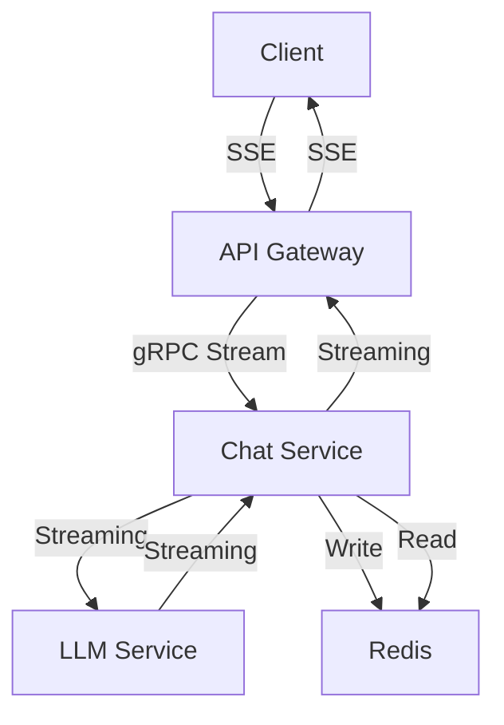
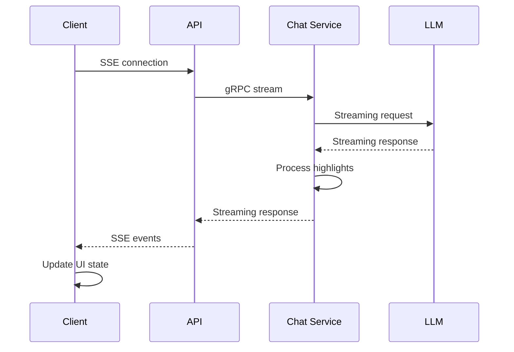
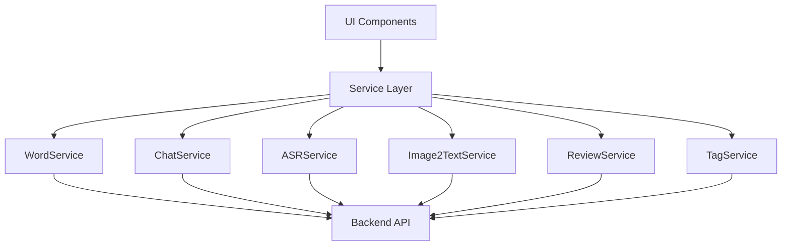
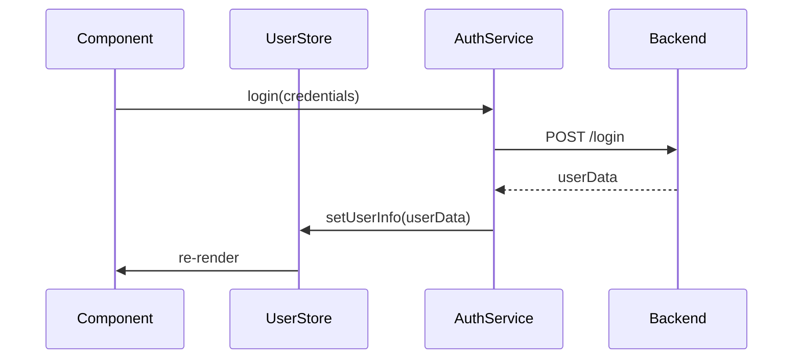
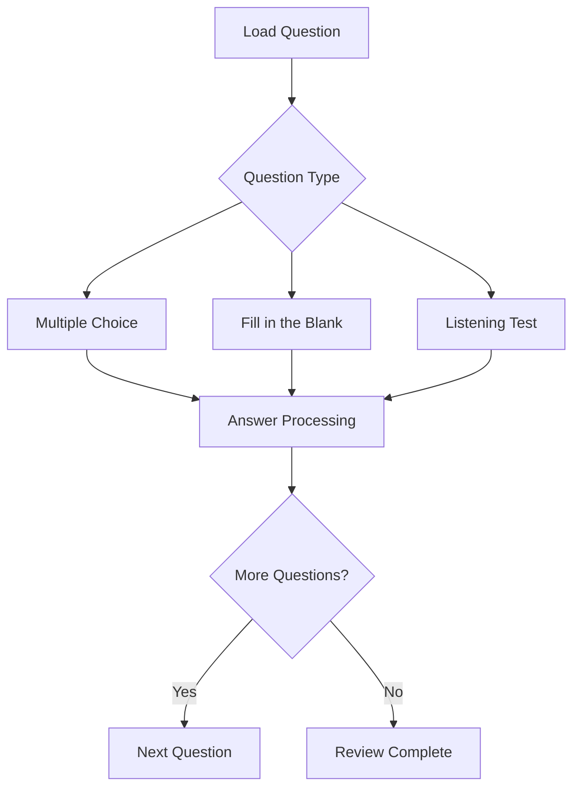

# Streams To River Client
English | [中文](README_CN.md)

This is the frontend client for the Streams To River word learning system, built with React and Taro framework.

## Project Overview
Streams To River is a comprehensive word learning system that provides:
- Word management and learning
- Scientific review system based on memory curve algorithm
- Quiz functionality with various question types
- Real-time chat interaction
- Progress tracking and analytics

## Prerequisites
- Node.js >= 18
- pnpm >= 9

## Getting Started
### Installation
```
pnpm install
```

### Development
To start the development server for H5 (web) version:
```
pnpm run dev:h5
```

### Building for Production
To build the H5 (web) version:
```
pnpm run build:h5
```
Or use the build script for automated build process:
```
./build.sh
```
The build script will:
1. Clean up existing build files
2. Install dependencies
3. Build the H5 version
4. Copy build artifacts to output directories

## Project Structure
- /src/components/ : Reusable UI components
- /src/pages/ : Main application pages
- /src/service/ : API services and business logic
- /src/store/ : State management
- /src/assets/ : Static assets (images, icons, etc.)

## Key Features
1. Word Management
  - Add and query words
  - View detailed word information
  - Organize words in lists
2. Review System
  - Scientific review scheduling based on memory curve
  - Multiple question types (multiple choice, fill-in-blank, pronunciation)
  - Progress tracking
3. Interactive Learning
  - Real-time chat functionality
  - Progress visualization
  - Performance analytics
  
## Supported Platforms
- Web (H5)

## State Management
The application uses a robust state management approach:
- Zustand for global state (such as chat messages)
- React hooks for component-level state
- Immer for immutable state updates

```javascript
set(produce(state => {
  state.messageLinks.push(messageId);
  state.messageMap[messageId] = {
    text,
    creator: 'user',
    id: messageId
  };
}));
```

## Streaming Chat Communication
The real-time communication system employs a bidirectional streaming architecture with these core components:
- components

- message pipeline



## Development Guide

### Creating New Components
- Define clear component boundaries
- Specify TypeScript interfaces for props
- Use Less for styling
- Consider platform differences (H5 vs Mini Program)
- Add Storybook stories for development

### Component Composition
- Prefer composition over inheritance
- Use context for deep prop passing
- Keep component interfaces minimal

```jsx
<InputBar>
  <CameraButton />
  <MicButton />
  <SendButton />
</InputBar>
```

## Service Layer
The service layer in this application serves as a crucial bridge between frontend components and backend services, implementing a robust architecture for handling various API interactions.

Key features:

- Singleton pattern implementation
- Type-safe interfaces
- Centralized configuration
- Standardized error handling
- Separation of concerns



## Page Architecture
The application is built with a multi-page architecture using the Taro framework, supporting both H5 and Mini Program platforms. Each page has a specific purpose and user experience flow.

### 1. Index Page (Chat Interface)
The Index page serves as the intelligent conversation center where users can interact with the AI assistant for language learning.

Key Features:

- Real-time streaming conversation with AI assistant
- Multi-modal input (text, voice, image)
- Automatic word extraction and highlighting
- Suggested questions for quick learning scenarios

### 2. Login Page
A streamlined authentication interface for user access control.

Key Features:

- User authentication
- Session management
- Error handling with friendly messages



### 3. Study Main Page
The central hub for learning activities and progress tracking.
Key Features:
- Learning progress visualization with circular gauge
- Vocabulary list management
- Review system entry point
- User information and statistics

### 4. Words List Page
A dedicated page for vocabulary management and organization.
Key Features:
- Complete vocabulary library display
- Search and filtering capabilities
- Batch operations (tag)
- Detailed word information access

### 5. Words Study Page
An immersive learning interface for focused vocabulary study.
Key Features:
- Card-based learning interface (similar to Anki)
- Gesture-based navigation (swipe left/right)
- Learning progress indicator
- Smooth transition animations

### 6. Vocabulary Review Component

