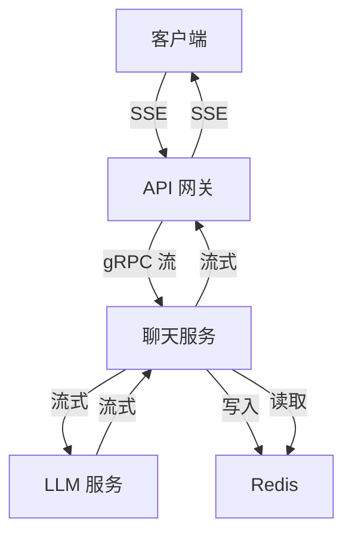
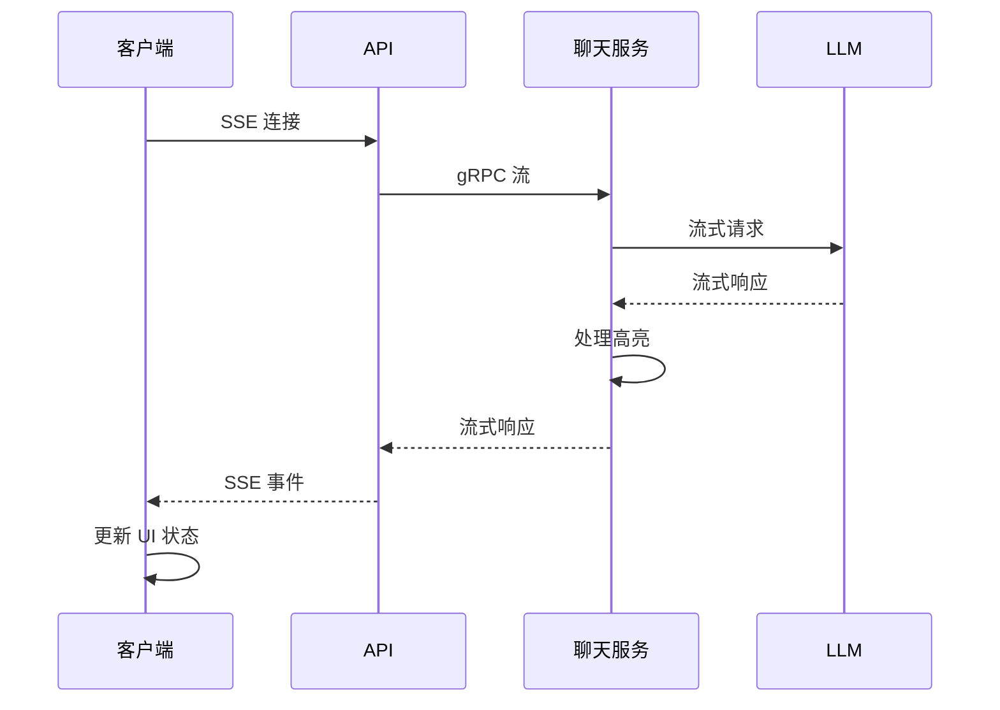
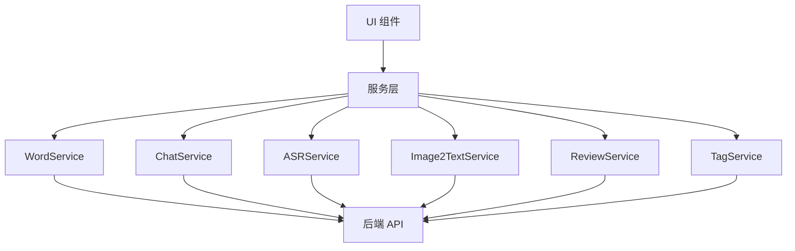
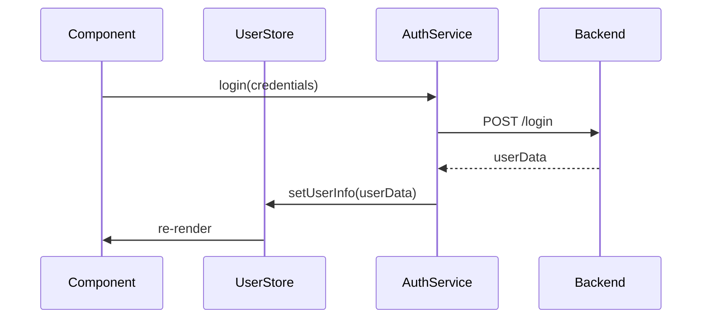
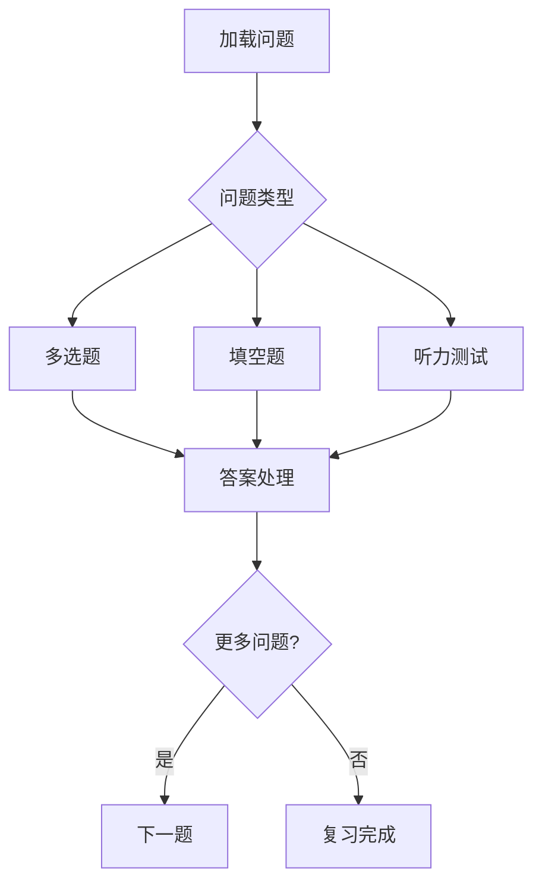

# 积流成江前端
[English](README.md) | 中文

积流成江单词学习系统的前端，基于 React 和 Taro 框架构建。

## 项目概述
积流成江是一个全面的单词学习系统，提供：
- 单词管理和学习
- 基于记忆曲线算法的科学复习系统
- 多种题型的测验功能
- 实时聊天交互
- 进度跟踪和分析

## 环境要求
- Node.js >= 18
- pnpm >= 9

## 快速开始
### 安装
```
pnpm install
```

### 开发
启动 H5（网页）版本的开发服务器：
```
pnpm run dev:h5
```

### 生产构建
构建 H5（网页）版本：
```
pnpm run build:h5
```
或使用构建脚本进行自动化构建：
```
./build.sh
```
构建脚本将：
1. 清理现有构建文件
2. 安装依赖
3. 构建 H5 版本
4. 将构建产物复制到输出目录

## 项目结构
- /src/components/ : UI 组件
- /src/pages/ : 主应用页面
- /src/service/ : API 服务和业务逻辑
- /src/store/ : 状态管理
- /src/assets/ : 静态资源（图片、图标等）

## 核心功能
1. 单词管理
  - 添加和查询单词
  - 查看详细单词信息
  - 在列表中组织单词
2. 复习系统
  - 基于记忆曲线的科学复习计划
  - 多种题型（多选题、填空题、发音）
  - 进度跟踪
3. 互动学习
  - 实时聊天功能
  - 进度可视化
  - 性能分析
  
## 支持平台
- 网页 (H5)

## 状态管理
应用使用的状态管理方法：
- Zustand 用于全局状态（如聊天消息）
- React hooks 用于组件级状态
- Immer 用于不可变状态更新

```javascript
set(produce(state => {
  state.messageLinks.push(messageId);
  state.messageMap[messageId] = {
    text,
    creator: 'user',
    id: messageId
  };
}));
```

## 流式聊天通信
实时通信系统采用双向流式架构，核心组件包括：
- 核心组件交互


- 消息pipeline

## 开发指南
### 创建新组件
- 定义清晰的组件边界
- 为 props 指定 TypeScript 接口
- 使用 less 进行样式设计
- 考虑平台差异（H5 vs 小程序）
### 组件组合
- 优先使用组合而非继承
- 使用 context 进行深层 prop 传递
- 保持组件接口简洁
```jsx
<InputBar>
  <CameraButton />
  <MicButton />
  <SendButton />
</InputBar>
```
## Service 层
本应用中的服务层是前端组件和后端服务之间的关键桥梁，实现了一个强大的架构来处理各种 API 交互。

主要特点：

- 单例模式实现
- 类型安全接口
- 集中式配置
- 标准化错误处理
- 关注点分离

## 页面架构
应用使用 Taro 框架构建多页面架构，支持 H5 和小程序平台。每个页面都有特定的目的和用户体验流程。

### 1. 首页（聊天界面）
首页作为智能对话中心，用户可以与 AI 助手进行语言学习交互。

主要功能：

- 与 AI 助手的实时流式对话
- 多模态输入（文本、语音、图像）
- 自动单词提取和高亮
- 快速学习场景的建议问题
### 2. 登录页面
简化的身份验证界面，用于用户访问控制。

主要功能：

- 用户认证
- 会话管理
- 友好的错误处理消息

### 3. 学习主页
学习活动和进度跟踪的中心枢纽。
主要功能：

- 带圆形仪表盘的学习进度可视化
- 词汇列表管理
- 复习系统入口
- 用户信息和统计数据
### 4. 单词列表页面
专用于词汇管理和组织的页面。
主要功能：

- 完整词汇库显示
- 搜索和过滤功能
- 批量操作（标签）
- 详细单词信息访问
### 5. 单词学习页面
专注词汇学习的沉浸式界面。
主要功能：

- 基于卡片的学习界面（类似 Anki）
- 基于手势的导航（左右滑动）
- 学习进度指示器
- 平滑过渡动画
### 6. 词汇复习组件

