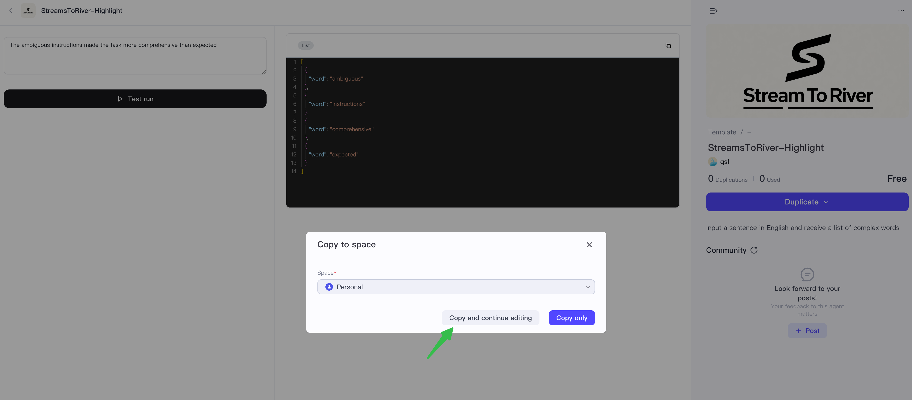
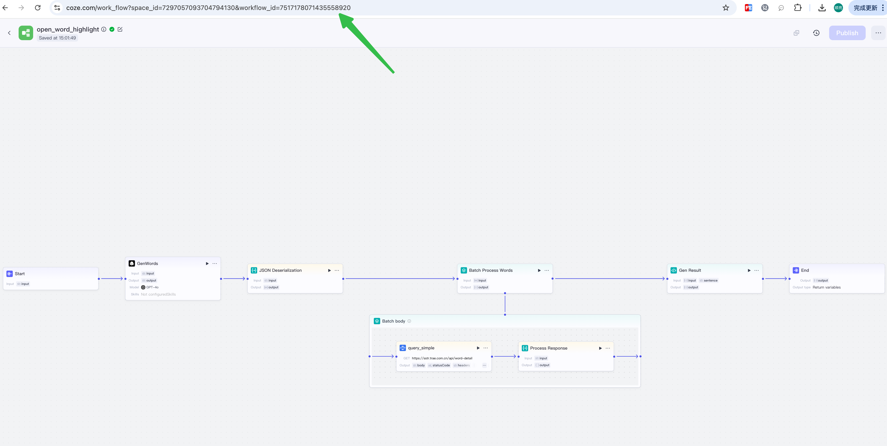
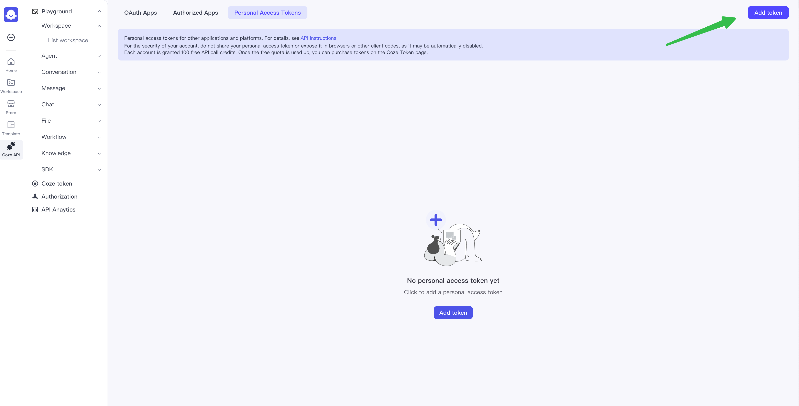
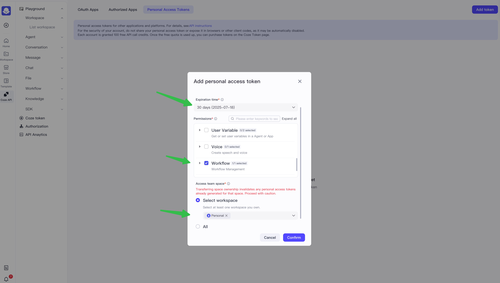
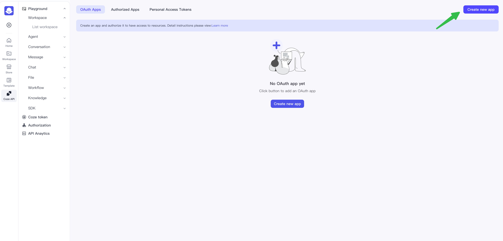
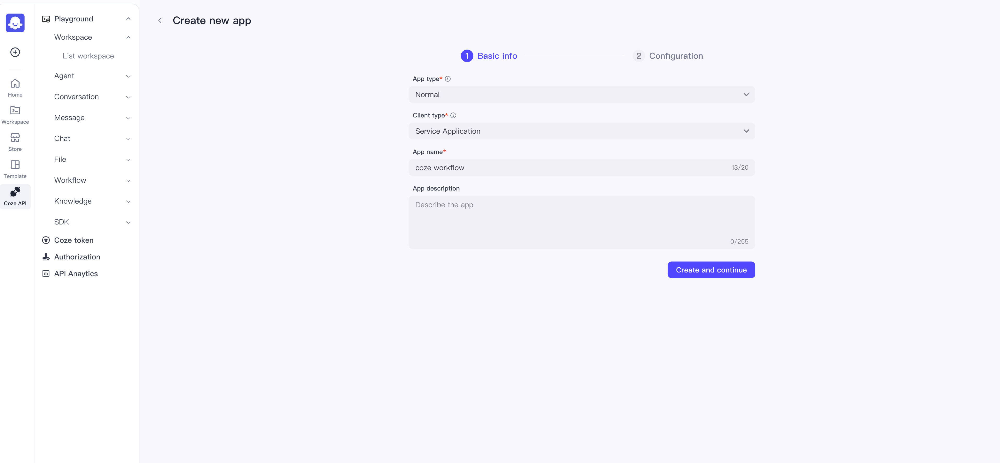
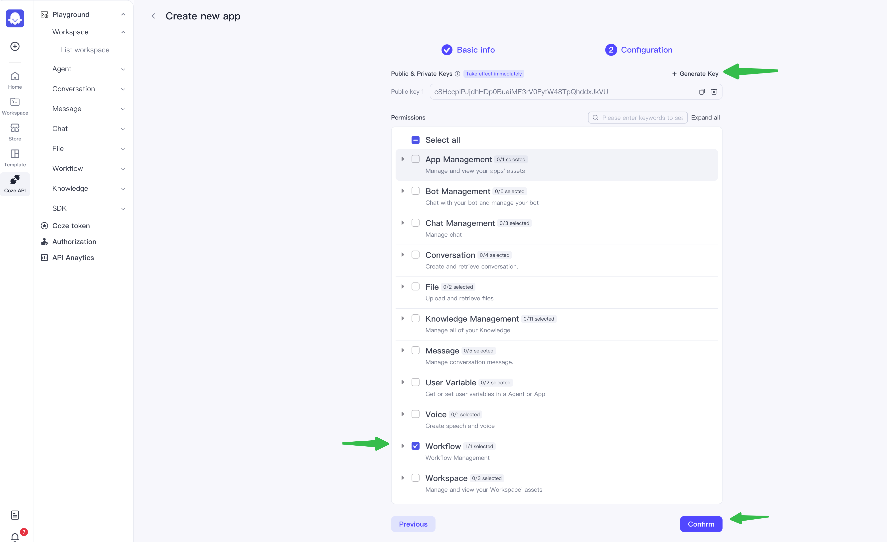
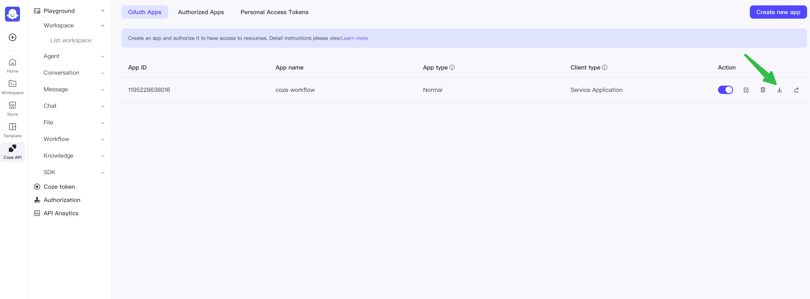

# Coze Configuration

## Description
The underlined words use the Coze Workflow configuration, where you input a sentence in English and receive a list of complex words. The workflow is open-sourced in the Coze template, and the configuration consists of the following:

| Field Name   | Description                                                                                             |
|--------------|---------------------------------------------------------------------------------------------------------|
| WorkflowID   | ID of the workflow being executed                                                                       |
| Auth         | Authorization mode, divided into PAT and JWT. PAT is a temporary token valid for up to 30 days, while JWT mode uses PublishKey/PrivateKey to refresh the token regularly, making it long-term valid |
| Token        | Temporary token in PAT authorization mode                                                               |
| ClientID     | ClientID in JWT mode                                                                                    |
| PublishKey   | PublishKey in JWT mode                                                                                  |
| PrivateKey   | PrivateKey in JWT mode                                                                                  |

## Copy Workflow
The underlined words workflow is open-sourced in the Coze template: [Coze Template EN](https://www.coze.com/template/workflow/7517191316061569042?entity_type=23) | [Coze Template CN](https://www.coze.cn/template/workflow/7516837716395458611?entity_type=23)

1. Copy to personal space  
     
   

2. Obtain Workflow ID  
   

## Authorization

### PAT Mode
1. Open Coze API [EN](https://www.coze.com/open/oauth/pats) | [CN](https://www.coze.cn/open/oauth/pats), select Personal Access Token  
   

2. Click to create a new token, input expiration date, select the workflow, choose the space where the workflow is located, and click confirm to obtain the token  
   

### JWT Mode
1. Open Coze API [EN](https://www.coze.com/open/oauth/apps) | [CN](https://www.coze.cn/open/oauth/apps), select Oauth Application  
   

2. Click to create a new application, select service application, click next, click add Key, and select workflow interface, then click confirm  
     
   

3. Click to download the instance file to obtain ClientID, PublishKey, and PrivateKey  
     