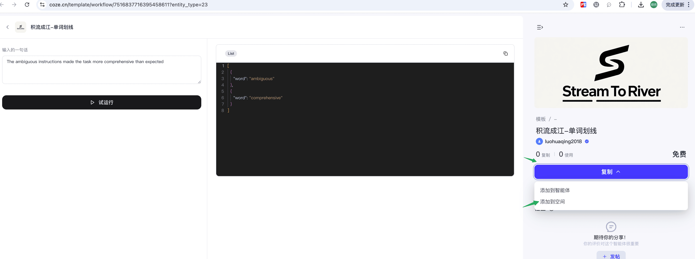
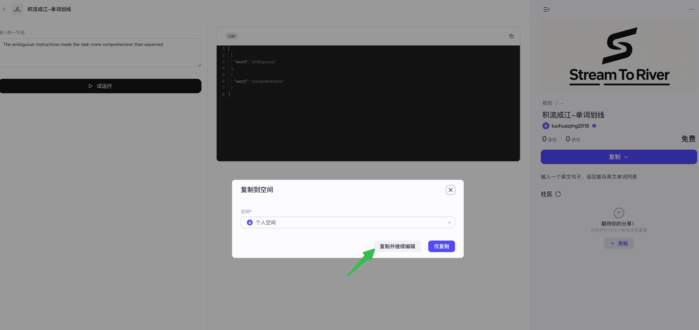
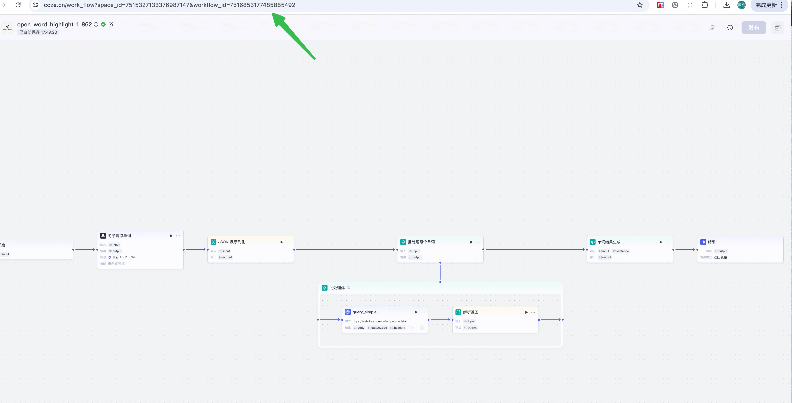
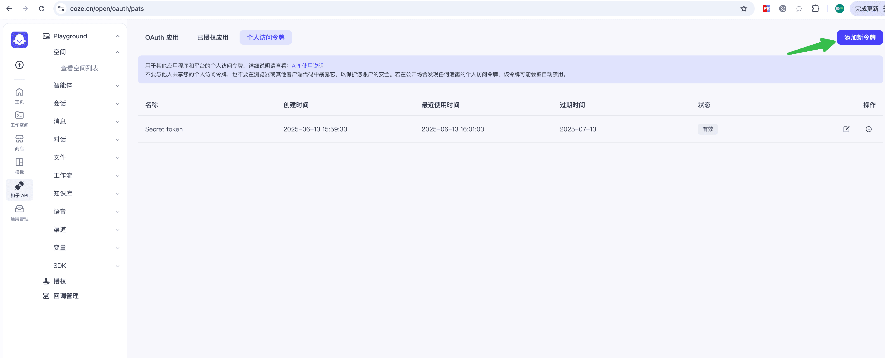
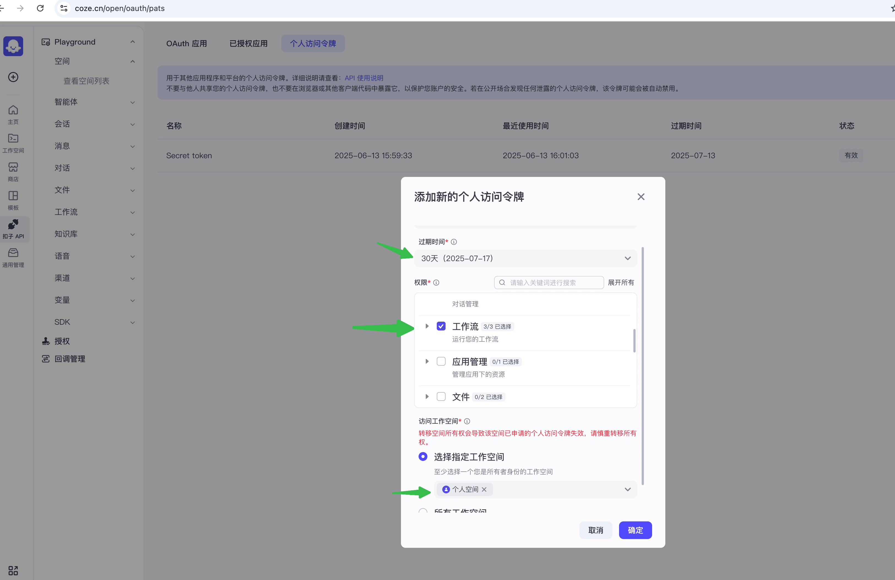
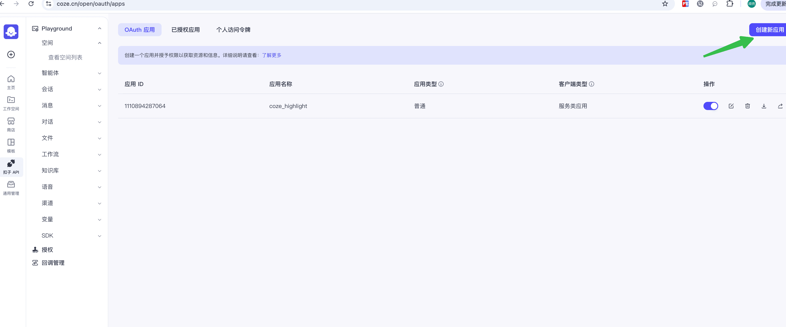
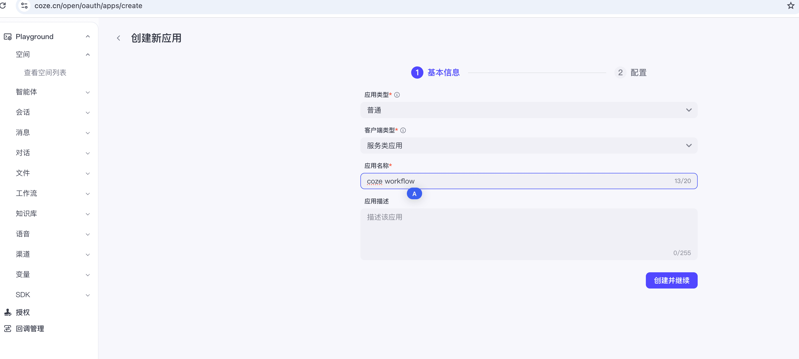
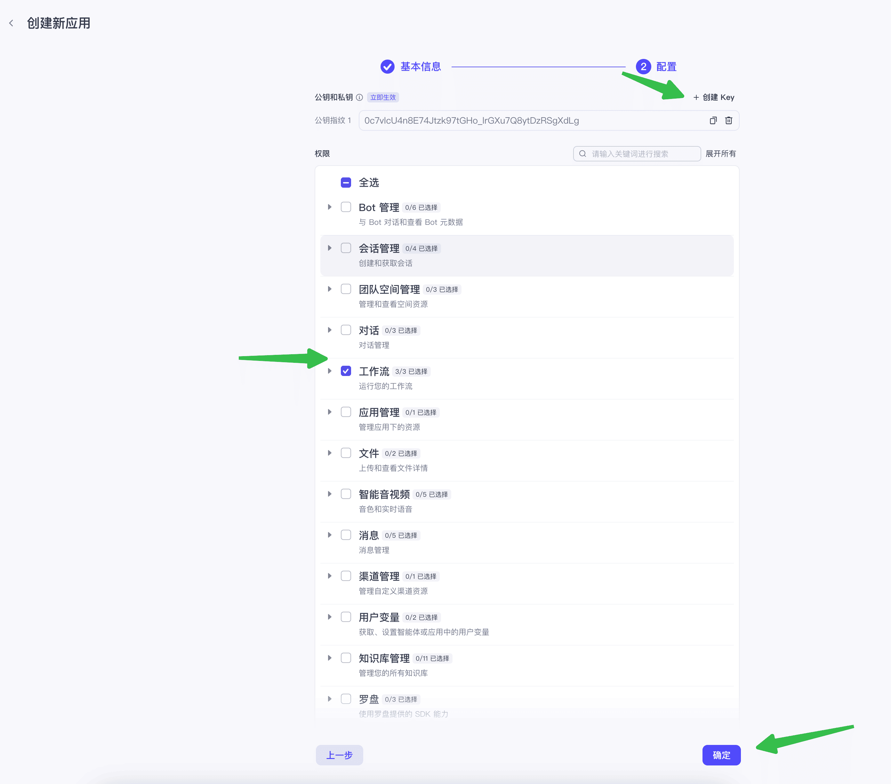
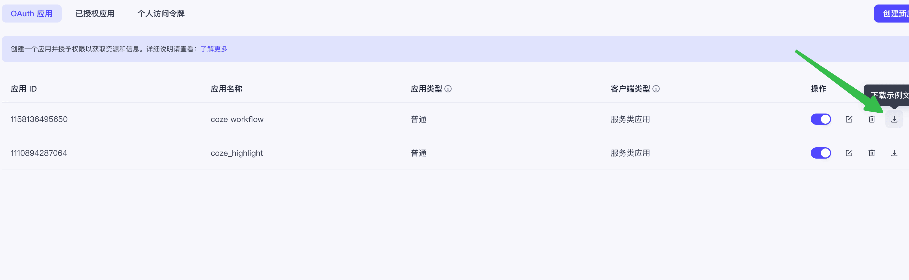

# Coze 配置
## 说明
单词划线采用 Coze Workflow 配置，输入一段英文句子，返回复杂单词列表，其中工作流已经开源至 Coze 模版，配置由以下组成:

| 字段名称     | 描述                                                                                         |
|--------------|--------------------------------------------------------------------------------------------|
| WorkflowID   | 执行的工作流 ID                                                                                  |
| Auth         | 授权模式，分为 PAT 和 JWT 两种。PAT 为最多 30天的临时 Token, JWT 模式通过 PublishKey/PrivateKey 定时刷新 Token，长期不过期 |
| Token        | PAT 授权模式下的临时 Token                                                                         |
| ClientID     | JWT 模式下的 ClientID                                                                          |
| PublishKey   | JWT 模式下的 PublishKey                                                                        |
| PrivateKey   | JWT 模式下的 PrivateKey                                                                        |
## 复制工作流
单词划线的工作流已开源至 Coze 模版 https://www.coze.cn/template/workflow/7516837716395458611?entity_type=23
1. 复制到个人空间

2. 获取工作流 ID

## 授权
### PAT 模式
1. 打开 Coze API https://www.coze.cn/open/oauth/pats ，选择个人访问令牌

2. 点击新建令牌，输入过期时间、勾选工作流，选择工作流所在空间，点击确认，即可获取 Token

### JWT 模式
1. 打开 Coze API https://www.coze.cn/open/oauth/apps ，选择 Oauth 应用

2. 点击创建新应用，选择服务类应用，点击下一步，点击添加 Key,并选择工作流接口，点击确认

3. 点击下载实例文件，从而获取到 ClientID, PublishKey, PrivateKey
